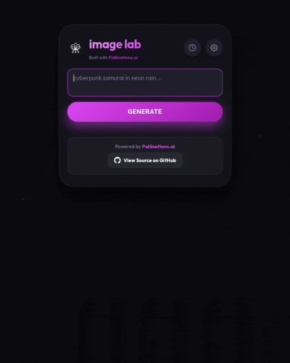
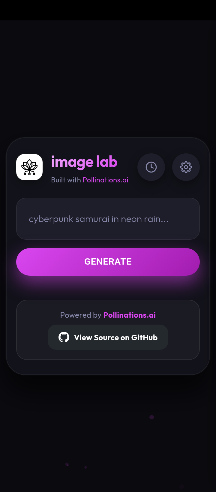
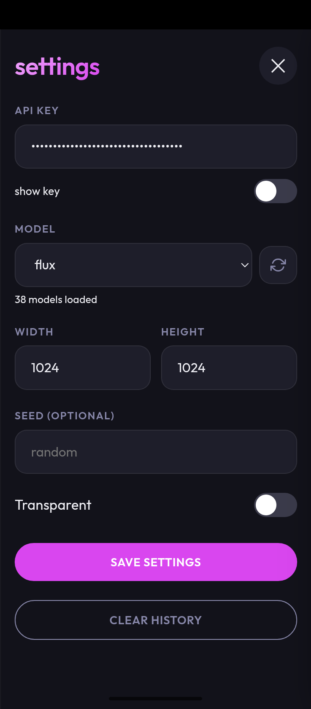

<div align="center">

# 🎨 Pollinations Image Lab

### A modern, lightweight and dependency-free AI image generation client for Pollinations AI.

Generate AI images with the latest available Pollinations models using a clean, responsive interface with advanced generation controls, prompt history, and zero build tools.

<p>

<a href="https://raptorvampire.github.io/pollinations-image-lab/">

</a>

<a href="https://github.com/RaptorVampire/pollinations-image-lab/stargazers">

</a>

<a href="https://github.com/RaptorVampire/pollinations-image-lab/network/members">

</a>

<a href="https://github.com/RaptorVampire/pollinations-image-lab/issues">

</a>

<a href="https://github.com/RaptorVampire/pollinations-image-lab/blob/main/LICENSE">

</a>

</p>

<p>


</p>

<p>

<strong>⚡ Zero Dependencies</strong> •
<strong>🌐 Browser Native</strong> •
<strong>📱 Mobile Friendly</strong> •
<strong>🎨 Multiple Models</strong>

</p>

</div>

---

# Demo

<p align="center">



</p>

---

## Highlights

- 🎨 Generate AI images using Pollinations AI
- 🚀 Automatically fetch the latest available models
- ⚙️ Advanced generation controls
- 🖼 Multiple image models
- 📏 Custom image dimensions
- 🎲 Seed support
- 📜 Prompt history
- 💾 Persistent settings
- 📥 One-click image download
- 📱 Responsive interface
- ⚡ Zero dependencies
- 🌐 Runs entirely inside your browser

---

# Screenshots

<p align="center">




</p>

<p align="center">




</p>

---

# Why Pollinations Image Lab?

Pollinations AI provides an excellent image generation API.

Pollinations Image Lab focuses on making that API easy and enjoyable to use.

Instead of relying on frontend frameworks, package managers, or build tools, the application is built entirely with modern browser technologies.

The result is a project that is:

- Lightweight
- Fast
- Easy to understand
- Easy to maintain
- Easy to extend

Everything runs directly inside your browser.

No backend required.

No installation required.

---

# Features

## AI Image Generation

Generate images using the latest Pollinations models with a clean and responsive interface.

### Supported capabilities

- Multiple image models
- Automatic model discovery
- Prompt generation
- Image preview
- Image download

---

## Advanced Controls

Fine-tune image generation with:

- Width
- Height
- Aspect Ratio
- Seed
- Model Selection
- API Key
- Generation Parameters

---

## Productivity

Built for everyday usage.

Features include:

- Prompt History
- Persistent Settings
- Responsive Layout
- Mobile Support

---

# Live Demo

The easiest way to use Pollinations Image Lab is through GitHub Pages.

## https://raptorvampire.github.io/pollinations-image-lab/

No installation.

No setup.

Works on desktop and mobile.

---

# Running Locally

Clone the repository.

```bash
git clone https://github.com/RaptorVampire/pollinations-image-lab.git
```

Because the project uses ES Modules, it should be served using a local web server.

### Python

```bash
python -m http.server
```

### Node.js

```bash
npx serve
```

### VS Code

Use the **Live Server** extension.

Then open

```
http://localhost:8000
```

---

# Project Structure

```text
.
├── assets/.
│
├── css/
│
├── js/
│   ├── app.js
│   └── modules/
│       ├── api.js
│       ├── config.js
│       ├── generator.js
│       ├── history.js
│       ├── settings.js
│       ├── ui.js
│       └── utils.js
│
├── index.html
└── README.md
```

---

# Architecture

```
Browser

      │

      ▼

  index.html

      │

      ▼

    app.js

      │

 ┌────┴──────────────────────────┐

 ▼                               ▼

UI Modules                 API Modules

 │                               │

 ▼                               ▼

History                  Pollinations API

Settings

Utilities

Configuration
```

Each module has a single responsibility, making the project easier to understand, maintain, and extend.

---

# Design Philosophy

Pollinations Image Lab embraces simplicity.

Instead of introducing unnecessary complexity, the project relies on standard browser APIs and modern JavaScript.

No frameworks.

No build process.

No transpilers.

No package managers.

Modern browsers already provide everything required to build fast, maintainable applications.

---

# Browser Support

Pollinations Image Lab works in all modern browsers that support ES Modules.

- Chrome
- Edge
- Firefox
- Safari

---

# Contributing

Contributions are always welcome.

Whether you want to:

- Report a bug
- Suggest a feature
- Improve the UI
- Improve documentation
- Optimize performance
- Refactor code

feel free to open an Issue or Pull Request.

If you're planning a significant change, please open an issue first so the proposed changes can be discussed before implementation.

---

# Support

If you find this project useful, consider giving it a ⭐.

Stars help more developers discover the project and motivate future development.

<div align="center">

<a href="https://github.com/RaptorVampire/pollinations-image-lab">


</a>

</div>

---

# License

Released under the MIT License.